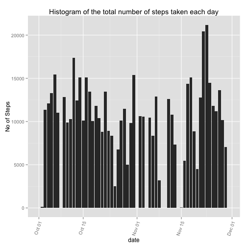

This assignment makes use of data from a personal activity monitoring device. This device collects data at 5 minute intervals through out the day. The data consists of two months of data from an anonymous individual collected during the months of October and November, 2012 and include the number of steps taken in 5 minute intervals each day.  

The variables included in this dataset are:  
- steps: Number of steps taking in a 5-minute interval (missing values are coded as NA)  
- date: The date on which the measurement was taken in YYYY-MM-DD format  
- interval: Identifier for the 5-minute interval in which measurement was taken  

## Loading and preprocessing the data
The code to load and preprocess the data is as follows. You need to install "xtable" and "ggplot2" packages if you have not done so.

```r
library(dplyr)
library(ggplot2)
library(knitr)
if (file.exists("activity.csv")) {
  activity <- read.csv("activity.csv",TRUE)
} else {
  unzip("activity.zip")
  activity <- read.csv("activity.csv",TRUE)
}
activity$date<-as.Date(activity$date)
```


```r
# Explore the data
str(activity)
```

```
## 'data.frame':	17568 obs. of  3 variables:
##  $ steps   : int  NA NA NA NA NA NA NA NA NA NA ...
##  $ date    : Date, format: "2012-10-01" "2012-10-01" ...
##  $ interval: int  0 5 10 15 20 25 30 35 40 45 ...
```

## What is mean total number of steps taken per day?

To calculate the total number of steps, use the following code: 

```r
act<- group_by(activity,date)
hist1 <- summarize(act, total_steps= sum(steps, na.rm = TRUE))
g<-qplot(x=date, y=total_steps,data=hist1,stat="identity",position ="dodge", geom="histogram", ylab="No of Steps",main="Histogram of the total number of steps taken each day") 
g<- g + theme(axis.text.x = element_text(angle = 70, hjust = 1))
print(g)
```

 

```r
dev.copy(png,'./instructions_fig/plot1.png', width = 480, height = 480)
```

```
## quartz_off_screen 
##                 5
```

```r
dev.off()
```

```
## RStudioGD 
##         2
```

The mean and median total number of steps taken per day is show in the table below.

```r
act<- group_by(activity,date)
table1 <- summarize(act, mean_steps= mean(steps, na.rm = TRUE)
                    , median_steps = median(steps, na.rm = TRUE))
kable(table1, format="markdown")
```


|date       | mean_steps| median_steps|
|:----------|----------:|------------:|
|2012-10-01 |        NaN|           NA|
|2012-10-02 |  0.4375000|            0|
|2012-10-03 | 39.4166667|            0|
|2012-10-04 | 42.0694444|            0|
|2012-10-05 | 46.1597222|            0|
|2012-10-06 | 53.5416667|            0|
|2012-10-07 | 38.2465278|            0|
|2012-10-08 |        NaN|           NA|
|2012-10-09 | 44.4826389|            0|
|2012-10-10 | 34.3750000|            0|
|2012-10-11 | 35.7777778|            0|
|2012-10-12 | 60.3541667|            0|
|2012-10-13 | 43.1458333|            0|
|2012-10-14 | 52.4236111|            0|
|2012-10-15 | 35.2048611|            0|
|2012-10-16 | 52.3750000|            0|
|2012-10-17 | 46.7083333|            0|
|2012-10-18 | 34.9166667|            0|
|2012-10-19 | 41.0729167|            0|
|2012-10-20 | 36.0937500|            0|
|2012-10-21 | 30.6284722|            0|
|2012-10-22 | 46.7361111|            0|
|2012-10-23 | 30.9652778|            0|
|2012-10-24 | 29.0104167|            0|
|2012-10-25 |  8.6527778|            0|
|2012-10-26 | 23.5347222|            0|
|2012-10-27 | 35.1354167|            0|
|2012-10-28 | 39.7847222|            0|
|2012-10-29 | 17.4236111|            0|
|2012-10-30 | 34.0937500|            0|
|2012-10-31 | 53.5208333|            0|
|2012-11-01 |        NaN|           NA|
|2012-11-02 | 36.8055556|            0|
|2012-11-03 | 36.7048611|            0|
|2012-11-04 |        NaN|           NA|
|2012-11-05 | 36.2465278|            0|
|2012-11-06 | 28.9375000|            0|
|2012-11-07 | 44.7326389|            0|
|2012-11-08 | 11.1770833|            0|
|2012-11-09 |        NaN|           NA|
|2012-11-10 |        NaN|           NA|
|2012-11-11 | 43.7777778|            0|
|2012-11-12 | 37.3784722|            0|
|2012-11-13 | 25.4722222|            0|
|2012-11-14 |        NaN|           NA|
|2012-11-15 |  0.1423611|            0|
|2012-11-16 | 18.8923611|            0|
|2012-11-17 | 49.7881944|            0|
|2012-11-18 | 52.4652778|            0|
|2012-11-19 | 30.6979167|            0|
|2012-11-20 | 15.5277778|            0|
|2012-11-21 | 44.3993056|            0|
|2012-11-22 | 70.9270833|            0|
|2012-11-23 | 73.5902778|            0|
|2012-11-24 | 50.2708333|            0|
|2012-11-25 | 41.0902778|            0|
|2012-11-26 | 38.7569444|            0|
|2012-11-27 | 47.3819444|            0|
|2012-11-28 | 35.3576389|            0|
|2012-11-29 | 24.4687500|            0|
|2012-11-30 |        NaN|           NA|

## What is the average daily activity pattern?
A time series plot (i.e. type = "l") of the 5-minute interval (x-axis) and the average number of steps taken, averaged across all days (y-axis) is shown below.

```r
act<- group_by(activity,interval)
time1 <- summarize(act, mean_steps= mean(steps, na.rm = TRUE))
g<-qplot(x=interval, y=mean_steps,data=time1,stat="identity"
         ,position ="dodge", ylab="Average No of Steps"
         ,main="Average number of steps taken each interval"
         ,type="l") 
g<- g + theme(axis.text.x = element_text(angle = 70, hjust = 1))+geom_line()
print(g)
```

```
## ymax not defined: adjusting position using y instead
```

 

```r
dev.copy(png,'./instructions_fig/plot2.png', width = 480, height = 480)
```

```
## quartz_off_screen 
##                 5
```

```r
dev.off()
```

```
## RStudioGD 
##         2
```

The 5-minute interval, on average across all the days in the dataset, that contains the maximum number of steps is determined as follows.

```r
intervalMax <- time1[time1["mean_steps"]==max(time1$mean_steps),"interval"] 
print(intervalMax)
```

```
## Source: local data frame [1 x 1]
## 
##   interval
## 1      835
```
The 5-minute interval with the maximum average number of steps across all days is 835.

## Imputing missing values
The total number of missing values in the dataset (i.e. the total number of rows with NAs) is derived as follows.

```r
good<-complete.cases(activity)
missingAct <- activity[!good,]
missing <- length(missingAct[,"steps"])
```
The total number of missing values in the dataset is 2304.

The strategy for dealing with missing values is to replace them with the mean for that 5-minute interval across all days. Based on this strategy, the a new dataset that is equal to the original dataset but with the missing data filled in, is derived as follows.

```r
activity2<- activity[good,] # complete cases
missingAct<-left_join(missingAct,time1,by=c("interval")) # join time1= mean steps per interval, calculated earlier.
missingAct[,"steps"]<-missingAct[,"mean_steps"] # replace missing values
# merge data bact
activity2<- rbind(activity2,missingAct[,c("steps","date","interval")])
```

A histogram of the total number of steps taken each day is shown below.

```r
act2<- group_by(activity2,date)
hist2 <- summarize(act2, total_steps= sum(steps, na.rm = FALSE))
g2<-qplot(x=date, y=total_steps,data=hist2,stat="identity",position ="dodge", geom="histogram", ylab="Tota No of Steps",main="Histogram of the total number of steps taken each day") 
g2<- g2 + theme(axis.text.x = element_text(angle = 70, hjust = 1))
print(g2)
```

 

```r
dev.copy(png,'./instructions_fig/plot3.png', width = 480, height = 480)
```

```
## quartz_off_screen 
##                 5
```

```r
dev.off()
```

```
## RStudioGD 
##         2
```

The mean and median total number of steps taken per day with defaults applied to missing values are show in the table below.

```r
table1 <- summarize(act2, mean_steps= mean(steps, na.rm = TRUE)
                    , median_steps = median(steps, na.rm = TRUE))
kable(table1, format="markdown")
```


|date       | mean_steps| median_steps|
|:----------|----------:|------------:|
|2012-10-01 | 37.3825996|     34.11321|
|2012-10-02 |  0.4375000|      0.00000|
|2012-10-03 | 39.4166667|      0.00000|
|2012-10-04 | 42.0694444|      0.00000|
|2012-10-05 | 46.1597222|      0.00000|
|2012-10-06 | 53.5416667|      0.00000|
|2012-10-07 | 38.2465278|      0.00000|
|2012-10-08 | 37.3825996|     34.11321|
|2012-10-09 | 44.4826389|      0.00000|
|2012-10-10 | 34.3750000|      0.00000|
|2012-10-11 | 35.7777778|      0.00000|
|2012-10-12 | 60.3541667|      0.00000|
|2012-10-13 | 43.1458333|      0.00000|
|2012-10-14 | 52.4236111|      0.00000|
|2012-10-15 | 35.2048611|      0.00000|
|2012-10-16 | 52.3750000|      0.00000|
|2012-10-17 | 46.7083333|      0.00000|
|2012-10-18 | 34.9166667|      0.00000|
|2012-10-19 | 41.0729167|      0.00000|
|2012-10-20 | 36.0937500|      0.00000|
|2012-10-21 | 30.6284722|      0.00000|
|2012-10-22 | 46.7361111|      0.00000|
|2012-10-23 | 30.9652778|      0.00000|
|2012-10-24 | 29.0104167|      0.00000|
|2012-10-25 |  8.6527778|      0.00000|
|2012-10-26 | 23.5347222|      0.00000|
|2012-10-27 | 35.1354167|      0.00000|
|2012-10-28 | 39.7847222|      0.00000|
|2012-10-29 | 17.4236111|      0.00000|
|2012-10-30 | 34.0937500|      0.00000|
|2012-10-31 | 53.5208333|      0.00000|
|2012-11-01 | 37.3825996|     34.11321|
|2012-11-02 | 36.8055556|      0.00000|
|2012-11-03 | 36.7048611|      0.00000|
|2012-11-04 | 37.3825996|     34.11321|
|2012-11-05 | 36.2465278|      0.00000|
|2012-11-06 | 28.9375000|      0.00000|
|2012-11-07 | 44.7326389|      0.00000|
|2012-11-08 | 11.1770833|      0.00000|
|2012-11-09 | 37.3825996|     34.11321|
|2012-11-10 | 37.3825996|     34.11321|
|2012-11-11 | 43.7777778|      0.00000|
|2012-11-12 | 37.3784722|      0.00000|
|2012-11-13 | 25.4722222|      0.00000|
|2012-11-14 | 37.3825996|     34.11321|
|2012-11-15 |  0.1423611|      0.00000|
|2012-11-16 | 18.8923611|      0.00000|
|2012-11-17 | 49.7881944|      0.00000|
|2012-11-18 | 52.4652778|      0.00000|
|2012-11-19 | 30.6979167|      0.00000|
|2012-11-20 | 15.5277778|      0.00000|
|2012-11-21 | 44.3993056|      0.00000|
|2012-11-22 | 70.9270833|      0.00000|
|2012-11-23 | 73.5902778|      0.00000|
|2012-11-24 | 50.2708333|      0.00000|
|2012-11-25 | 41.0902778|      0.00000|
|2012-11-26 | 38.7569444|      0.00000|
|2012-11-27 | 47.3819444|      0.00000|
|2012-11-28 | 35.3576389|      0.00000|
|2012-11-29 | 24.4687500|      0.00000|
|2012-11-30 | 37.3825996|     34.11321|

These values differ from the estimates from the first part of the assignment with the days in which no data was recorded now having mean data. 

What is the impact of imputing missing data on the estimates of the total daily number of steps? The estimates who that values could vary sunstantially from what was recorded.

## Are there differences in activity patterns between weekdays and weekends?


```r
activity$weekday <- weekdays( as.Date(activity$date ))
activity$day_type <- ifelse( (activity$weekday=="Saturday" | activity$weekday=="Sunday"), "weekend", "weekday")
activity$day_type <- as.factor(activity$day_type)
str(activity)
```

```
## 'data.frame':	17568 obs. of  5 variables:
##  $ steps   : int  NA NA NA NA NA NA NA NA NA NA ...
##  $ date    : Date, format: "2012-10-01" "2012-10-01" ...
##  $ interval: int  0 5 10 15 20 25 30 35 40 45 ...
##  $ weekday : chr  "Monday" "Monday" "Monday" "Monday" ...
##  $ day_type: Factor w/ 2 levels "weekday","weekend": 1 1 1 1 1 1 1 1 1 1 ...
```


```r
weekend_data <- subset(activity, activity$day_type=="weekend")
weekday_data <- subset(activity, activity$day_type=="weekday")


weekend_intervalmeans <- aggregate(steps ~ interval, data=weekend_data, mean)
colNames <- names(weekend_intervalmeans)
colNames[2] <- "mean"
names(weekend_intervalmeans) <- colNames

weekday_intervalmeans <- aggregate(steps ~ interval, data=weekday_data, mean)
colNames <- names(weekday_intervalmeans)
colNames[2] <- "mean"
names(weekday_intervalmeans) <- colNames

par(mfrow=c(2,1))
plot(weekday_intervalmeans$interval, weekday_intervalmeans$mean, type="l", main="weekday")
plot(weekend_intervalmeans$interval, weekend_intervalmeans$mean, type="l", main="weekend")
```

 
